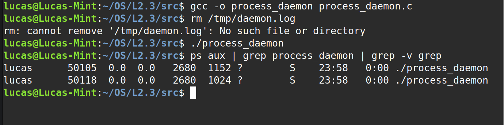

# **Homework 2: Zombie Process Handler - Demo**

This document provides the output and screenshots demonstrating the functionality of the programs created for this assignment. All tests were run from the project's root directory.

-----

## **Part 1 & 2: Zombie Creator and Detector**

This test verifies that `zombie_creator` successfully creates zombie processes and that `zombie_detector` can find and report on them.

**Test Procedure:**

1.  In one terminal, `zombie_creator` was run to create 10 zombie processes.
2.  In a second terminal, `zombie_detector` was run to find them.

#### **Terminal Output:**

-----

## **Part 3: Automatic Zombie Reaper**

This test runs `zombie_reaper` with all three strategies (explicit wait, `SIGCHLD` handler, and `SIG_IGN`). The verification command at the end of each run confirms that no zombie processes remain.

**Test Procedure:**
The `tests/test_reaper.sh` script was executed.

#### **Terminal Output:**

-----

## **Part 4: Long-Running Daemon**

This test verifies that `process_daemon` runs correctly in the background, spawns workers without creating zombies, logs its activity, and shuts down gracefully.

**Test Procedure:**
The `tests/test_daemon.sh` script was executed.

#### **1. Daemon Startup & Verification**

The daemon starts and detaches from the terminal. `ps` confirms it's running.

#### **2. Monitoring for Zombies**

The `watch` command monitors the system for zombies for 15+ seconds. The output remains blank, proving no zombies are being created.

#### **3. Checking the Log File**

The log file at `/tmp/daemon.log` shows the daemon's activity, including spawning workers and reaping them.

#### **4. Graceful Shutdown**

The daemon is terminated with `killall`, which sends `SIGTERM`. The process is no longer running, and the final shutdown message is visible in the log.

-----

## **Part 5: Zombie Prevention Library (`libzombie.a`)**

This test demonstrates the compilation and use of the static library `libzombie.a`.

**Test Procedure:**

1.  The library object file (`zombie.o`) is compiled.
2.  The static library (`libzombie.a`) is created using `ar`.
3.  The test program (`test_lib.c`) is compiled and linked against the library.
4.  The final executable `test_lib` is run.

#### **Terminal Output:**

